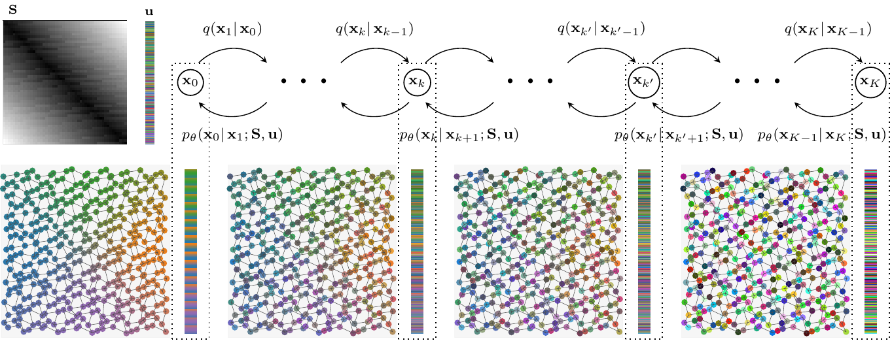
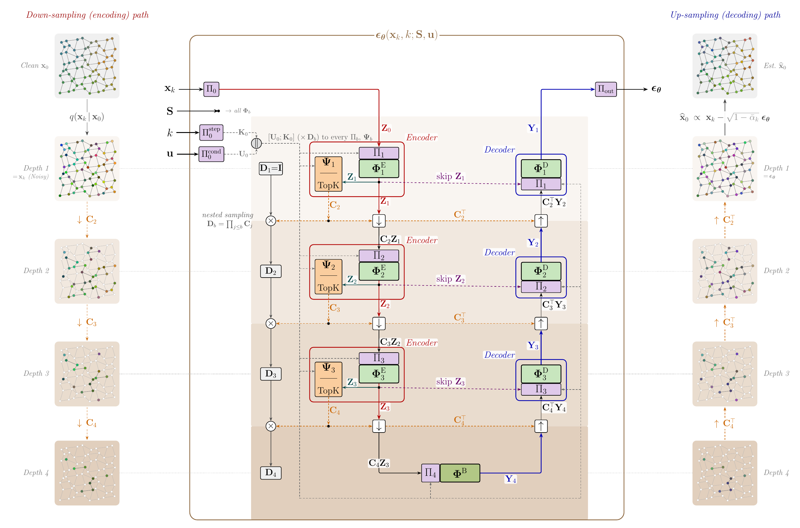
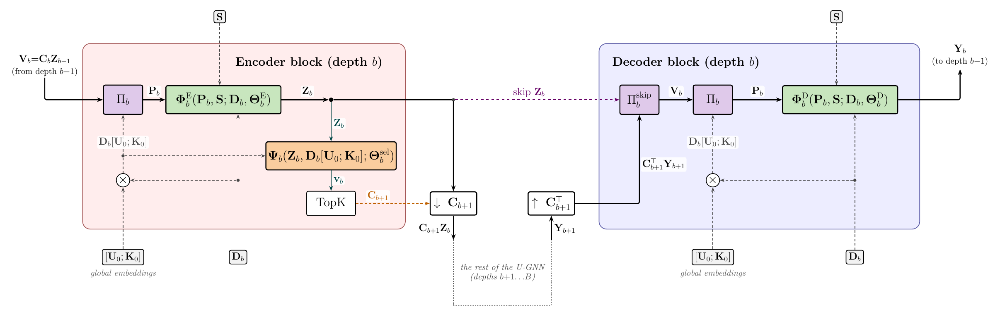
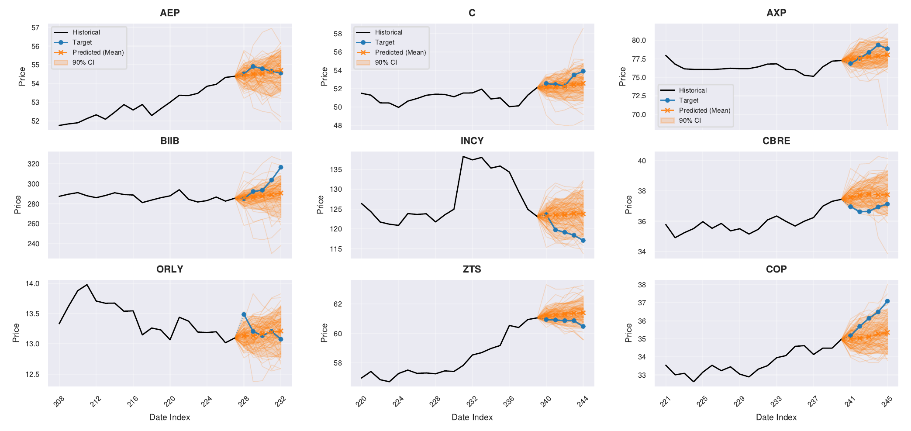
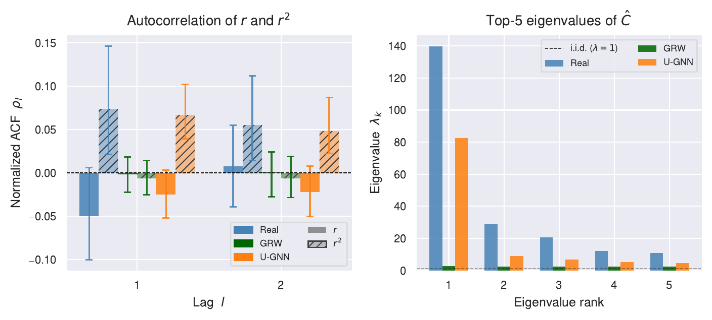
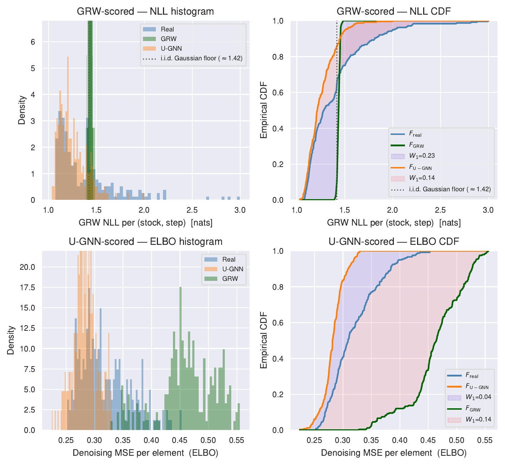
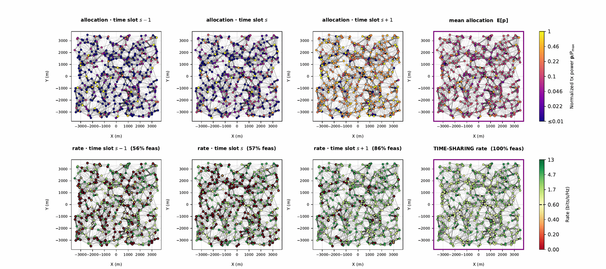

# Generative Diffusion Models of Stochastic Graph Signals

This repository contains the implementation code for the paper

> Y. B. Uslu, S. Hadou, S. Rozada, S. Saeedi Bidokhti, and A. Ribeiro, "Generative Diffusion Models of
> Stochastic Graph Signals," under review at *IEEE Transactions on Signal Processing*.
> [[arXiv](https://arxiv.org/abs/2607.xxxxx)]

A PyTorch framework for **conditional generative diffusion modeling of graph signals**. Many graph
machine learning tasks — financial forecasting, wireless network optimization, recommender systems —
require *sampling* signals supported on a graph from an unknown conditional distribution, rather than
regressing to a conditional mean. We cast such problems as conditional graph signal generation and
tackle them with a single denoising diffusion framework: a fixed forward process corrupts graph signals
into noise, and a learned reverse process, parametrized by a novel hierarchical **U-Graph Neural
Network (U-GNN)** denoiser, draws new samples conditioned directly on the graph topology — through its
shift operator **S** — and on node-feature side information **u**. The same backbone is shared across
domains; two applications are showcased below — **S&P 500 forecasting** and **wireless resource
allocation**. Please refer to the accompanying paper for details.


*A forward noising process **q(x<sub>k</sub> | x<sub>k−1</sub>)** gradually removes structure from a
graph signal over K steps (x<sub>0</sub> → x<sub>K</sub> ∼ N(0, I)); the reverse process
**p<sub>θ</sub>(x<sub>k−1</sub> | x<sub>k</sub>; S, u)** is trained to denoise prior samples back into
graph signals distributed approximately as q<sub>data</sub>(x<sub>0</sub> | S, u).*

---

## 1. U-Graph Neural Networks

The U-GNN generalizes the image-convolutional U-Net to graph-structured signals. It performs
multi-resolution encoder–decoder processing in which pooling and unpooling reduce to a **learned node
selection**, expressed by nested selection matrices trained end-to-end with the denoiser, and a
zero-padded lifting of coarse signals back to the full node set. Graph convolutions are carried out on
the original graph at every resolution, with a stride that sets their hop reach, so the U-GNN bypasses
explicit graph coarsening.





→ **[Details: the U-GNN architecture](assets/ugnn/README.md)** · full reference in
[docs/UGNN_ARCHITECTURE.md](docs/UGNN_ARCHITECTURE.md).

---

## 2. S&P 500 forecasting

Probabilistic 5-day forecasting of daily log-returns for N = 468 S&P 500 stocks over a static
correlation graph built from company fundamentals. Conditioned on a 20-day history of 12 market
features per stock, the model samples an ensemble of future return trajectories (mean + 90% CI per
stock), benchmarked against a geometric random walk (GRW). On the held-out test split, the U-GNN
reduces price CRPS, RMSE, and MAE by 22%, 28%, and 21%, raises direction accuracy above chance, and
reproduces stylized facts the GRW misses — volatility clustering and the cross-sectional eigenstructure
of returns.


*Ensemble forecasts (orange: sampled trajectories and their mean, with 90% CI) vs. realized target
(blue) over the 5-day horizon, across nine held-out test windows.*

→ Structural, distributional, and calibration comparisons vs. GRW are in the **[paper](#)** — meanwhile
see the **[details page](assets/sp500-sociable-frigatebird-619/README.md)** and
[reproduce end-to-end](reproduce/sp500-sociable-frigatebird-619/).

<!-- Fig. 2 / Fig. 3 material — commented out to keep the README short; still shown on
     the details page. Re-add here if desired:
The model reproduces stylized facts GRW misses — volatility clustering, cross-sectional
eigenstructure, and heavier-tailed returns:



-->

---

## 3. Wireless resource allocation

Power control for interference-limited wireless networks of N = 400 transmitter–receiver pairs:
maximize the ergodic sum-rate subject to a per-user minimum-rate (QoS) constraint
f<sub>min</sub> = 0.6 bits/s/Hz. The interference pattern of each network is a graph and a power
allocation is a **graph signal**. Trained to imitate an expert primal–dual (PD) algorithm across four
user densities, the U-GNN diffusion model samples near-optimal feasible allocations in a single
accelerated DDIM pass, instead of re-solving the optimization for every network.


*The optimal policy is stochastic and realized through time-sharing. The model samples a distribution
of allocations (top row: normalized TX power; bottom row: the ergodic rates they induce). Any single
allocation satisfies f<sub>min</sub> for only 56–86% of links, but time-sharing across the sampled
ensemble (rightmost panels) lifts every link above f<sub>min</sub> — 100% feasible.*

→ The "network as a graph signal" anatomy and per-density comparisons vs. the expert are on the
**[details page](assets/wra-rigorous-quoll/README.md)** and in the **[paper](#)**;
[reproduce end-to-end](reproduce/wra-rigorous-quoll/).

<!-- Additional figures kept on the details page to keep the README short: network anatomy
     (fig1_network_anatomy_low / fig1b_network_anatomy_high) and per-density tail rates
     (fig3_rate_percentiles). Re-add here if desired. -->

---

## Installation

```bash
git clone https://github.com/yigit-uslu/graph-signal-diffusion.git
cd graph-signal-diffusion
pip install -e .                 # development; or `pip install -r requirements.txt` for pinned versions
```

Full setup, configuration, training, and testing → **[docs/USAGE.md](docs/USAGE.md)**.

## Documentation

- [docs/USAGE.md](docs/USAGE.md) — installation, configuration, training, testing
- [docs/UGNN_ARCHITECTURE.md](docs/UGNN_ARCHITECTURE.md) — model architecture
- [docs/PRIMAL_DUAL_POWER_ALLOCATION.md](docs/PRIMAL_DUAL_POWER_ALLOCATION.md) — WRA optimization
- [docs/WRA_DATASET_CONFIGS.md](docs/WRA_DATASET_CONFIGS.md) · [docs/RESEARCH_WORKFLOW.md](docs/RESEARCH_WORKFLOW.md)

## Citation

Please use the following BibTeX entry to cite this work:

```bibtex
@article{uslu2026generative,
  title   = {Generative Diffusion Models of Stochastic Graph Signals},
  author  = {Uslu, Yi\u{g}it Berkay and Hadou, Samar and Rozada, Sergio and Saeedi Bidokhti, Shirin and Ribeiro, Alejandro},
  journal = {arXiv preprint arXiv:2607.xxxxx},
  year    = {2026},
  url     = {https://arxiv.org/abs/2607.xxxxx}
}
```

## License

This project is licensed under the MIT License.
