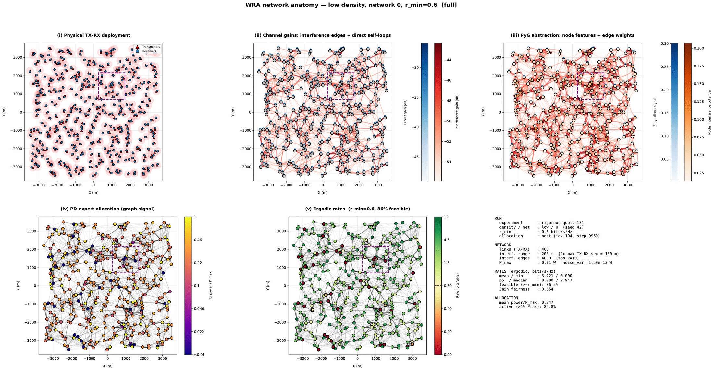
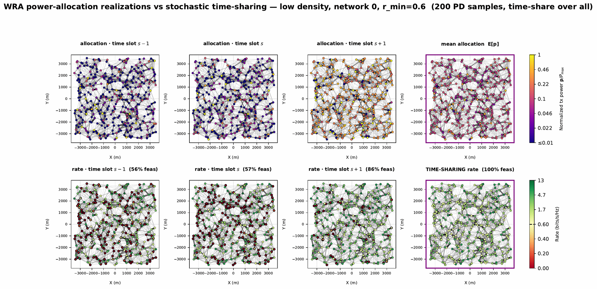
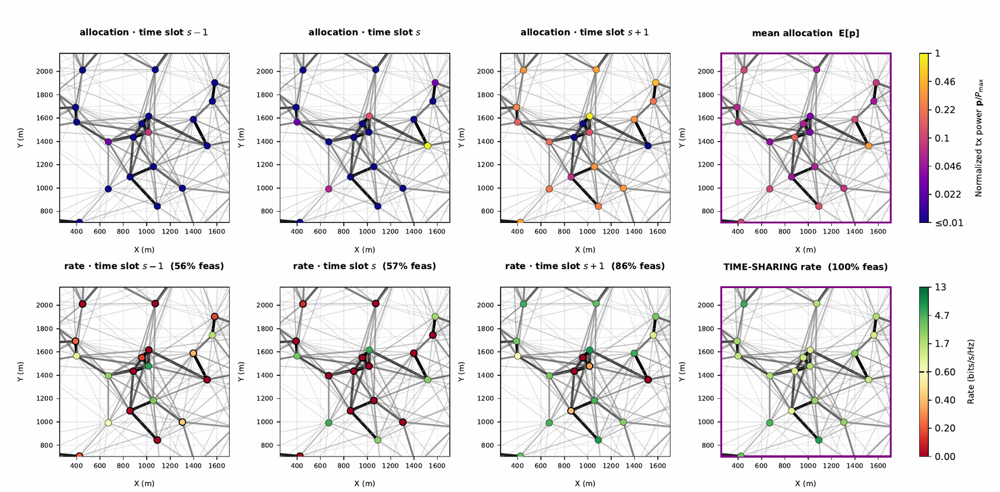
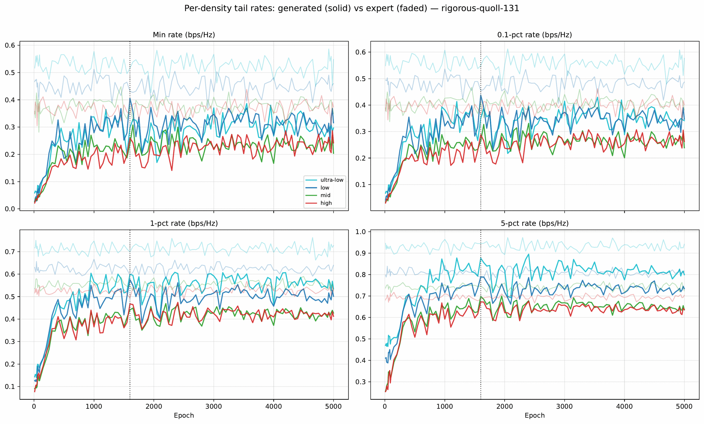

# Wireless Resource Allocation — `rigorous-quoll`

Diffusion-based power control for interference-limited wireless networks: maximize the ergodic
sum-rate subject to a per-user minimum-rate (QoS) constraint fmin = 0.6 bits/s/Hz (denoted
`r_min` in the code and figures). Each network comprises N = 400 transmitter–receiver pairs sharing a
single channel; its interference pattern defines a directed channel graph — self-loops carry direct-link
gains, edges the incoming interference from the 10 strongest interferers per receiver — whose
log-normalized weights form the GSO **S**, and a power allocation is a **graph signal** on it. The
diffusion targets are 200 converged primal iterates per training network from an expert primal–dual
(PD) algorithm, collected across four user densities (6.6–11.9 pairs/km², 32 networks each, split
5:1:2). Conditioned on (S, u), where u collects each pair's direct-link strength and aggregate incoming
interference, the U-GNN learns to sample from the expert allocation distribution — bypassing the
thousands of PD iterations per network with a single accelerated DDIM sampling pass.

## The problem as a graph signal

*A single low-density network in five views: physical TX–RX deployment → channel gains (interference +
direct) → PyG graph abstraction → PD-expert power allocation (the graph signal the model learns to
generate) → the ergodic rates it induces (fmin = 0.6 bits/s/Hz, 86.5% of links feasible).*

## Stochastic allocation & time-sharing

*The optimal policy is inherently stochastic: it is multi-modal, activating a different subset of the
mutually interfering pairs in each slot, and is realized through time-sharing. The diffusion model
captures this by sampling a **distribution** of allocations rather than one point estimate. Any single
realization satisfies fmin for only 56–86% of links, but cycling the sampled allocations
across slots lifts every link above fmin — **100% feasibility**. The single mean allocation
E[**p**], by contrast, activates every interferer at once and stays infeasible — precisely the failure
mode of a deterministic average-power policy.*

*The same figure zoomed into a 19-receiver subregion (cross-boundary edges trailed off): individual
per-link powers and rates are legible — note how links that are red (infeasible) in one slot turn green
under time-sharing.*

## Matching the expert across densities

*Tail rates (min / 0.1% / 1% / 5% percentiles) over training: the generated allocations (solid) track
the PD-expert reference (faded) across all four densities. On the held-out test networks, the U-GNN
policy trails the expert by only 5.3% and 0.9% at the 5th and 10th percentiles while matching its mean
rate (2.81 vs. 2.84 bits/s/Hz) and feasibility (98.1% vs. 99.1%) — where deterministic full-power and
average-power baselines collapse at the cell edge. The policy also transfers without retraining from
its native 400-pair training size to networks of 200–1600 pairs. The high-density anatomy view is also
available: [network anatomy — high density](fig1b_network_anatomy_high.png).*

## Reproduce

- Full pipeline (channel generation → PD-expert training → diffusion-dataset build →
  diffusion training → checkpoint eval → baselines/figures):
  **[reproduce/wra-rigorous-quoll/](../../reproduce/wra-rigorous-quoll/)**
- Figure provenance (exact source run, network parameters, regeneration): **[SOURCE.md](SOURCE.md)**
