# Configuration Hierarchy

This document describes the Hydra configuration system used for training and evaluation. All config files live under `src/graph_signal_diffusion/conf/`.

## Overview

The project uses [Hydra](https://hydra.cc/) for hierarchical configuration composition. A single entry point (`config.yaml`) selects a **task**, which in turn pulls in its own **dataset**, **model**, **diffusion**, and **trainer** defaults. Users can override any sub-group from the CLI without editing files.

```mermaid
graph TD
    config["config.yaml"]
    config -->|"task: ???<br/>(user selects)"| task

    subgraph task["Task (selects all sub-groups)"]
        direction TB
        wra["wireless_resource_allocation"]
        sp500v2["stock_price_forecasting_v2"]
        v1["stock_price_forecasting<br/>(legacy)"]
    end

    subgraph model["Model"]
        ugnn["ugnn.yaml<br/>(shared base)"]
        ugnn_wra["ugnn_wra.yaml"]
        ugnn_sp500["ugnn_sp500_v2.yaml"]
        ugnn_wra_lds2["ugnn_wra_learned_ds2.yaml"]
        ugnn_sp500_lds2["ugnn_sp500_v2_learned_ds2.yaml"]
        ugnn_legacy["ugnn_legacy.yaml<br/>(v1 only)"]
        ugnn --> ugnn_wra --> ugnn_wra_lds2
        ugnn --> ugnn_sp500 --> ugnn_sp500_lds2
    end

    subgraph diffusion["Diffusion"]
        ddpm["ddpm.yaml<br/>(shared base)"]
        ddpm_wra["ddpm_wra.yaml"]
        ddim["ddim.yaml<br/>(shared base)"]
        ddim_wra["ddim_wra.yaml"]
        ddpm --> ddpm_wra
        ddim --> ddim_wra
    end

    subgraph trainer["Trainer"]
        trainer_default["default.yaml<br/>(shared base)"]
        trainer_sp500["trainer_sp500.yaml"]
        trainer_wra_cfg["trainer_wra.yaml"]
        trainer_default --> trainer_sp500
        trainer_default --> trainer_wra_cfg
    end

    subgraph dataset["Dataset"]
        ds_wra["wra.yaml"]
        ds_wra_lld["wra_large_low_density.yaml"]
        ds_wra_slq["wra_small_low_qos.yaml"]
        ds_sp500["sp500.yaml"]
        ds_sp500c["sp500_cleaned.yaml"]
        ds_sp100["sp100.yaml"]
        ds_wra --> ds_wra_lld
        ds_wra --> ds_wra_slq
        ds_sp500 --> ds_sp500c
    end

    subgraph wandb_group["Wandb"]
        wandb_default["default.yaml"]
    end

    wra -->|"/model"| ugnn_wra
    wra -->|"/diffusion"| ddpm_wra
    wra -->|"/trainer"| trainer_wra_cfg
    wra -->|"/dataset"| ds_wra_lld

    sp500v2 -->|"/model"| ugnn_sp500
    sp500v2 -->|"/diffusion"| ddpm
    sp500v2 -->|"/trainer"| trainer_sp500
    sp500v2 -->|"/dataset"| ds_sp500

    v1 -->|"/model"| ugnn_legacy
    v1 -->|"/diffusion"| ddpm
    v1 -->|"/trainer"| trainer_sp500
    v1 -->|"/dataset"| ds_sp100

    config -->|"wandb: default"| wandb_default
```



## Config Groups

### Model (`conf/model/`)

| File | Inherits From | Purpose |
|------|--------------|---------|
| `ugnn.yaml` | — | **Shared base.** All hyperparameters common to WRA and SP500-v2: `base_channels=64`, `channel_multipliers=[1,1,1,1]`, `K=2`, `num_layers=2`, `dropout=0.05`, identity pooling, temporal mixer OFF. |
| `ugnn_wra.yaml` | `ugnn` | WRA-specific. Currently only sets `name: ugnn_wra` — all architecture params inherit from the base. |
| `ugnn_sp500_v2.yaml` | `ugnn` | SP500-v2. Enables temporal mixer (`use_temporal_mixer: true`, `temporal_use_pointwise: true`) and richer conditioning encoder (`cond_temporal_hidden_channels: [32,32]`, `cond_temporal_num_layers: 2`, `cond_temporal_kernel_size: 5`, `cond_temporal_pooling: ema`). |
| `ugnn_sp500_v2_temporal_projected.yaml` | `ugnn_sp500_v2` | SP500-v2 temporal projection variant. Enables `cond_temporal_output_mode=time_varying` with exact-size learned projection from conditioning horizon to output horizon. |
| `ugnn_sp500_v2_temporal_cross_attn.yaml` | `ugnn_sp500_v2_temporal_projected` | Phase-2 temporal conditioning variant. Keeps learned temporal projection and switches conditioning fusion to node-wise temporal cross-attention on active nodes only. |
| `ugnn_wra_learned_ds2.yaml` | `ugnn_wra` | Learned downsampling for WRA: `gamma=[1,2,2,2]`, `selection_method=learned`, `use_strided_conv=true`, STE selector. |
| `ugnn_sp500_v2_learned_ds2.yaml` | `ugnn_sp500_v2` | Learned downsampling for SP500: same pooling structure as WRA variant plus `temporal_score_agg=ema` and `ema_alpha_init=0.8`. |
| `ugnn_legacy.yaml` | — | Legacy v1 config (`base_channels=128`, `channel_multipliers=[1,2,2,2]`, `num_layers=3`). Used only by `stock_price_forecasting` (v1). |
| `unet.yaml` | — | Alternative U-Net architecture (not used in current experiments). |
| `diffstg.yaml` | — | DiffSTG baseline placeholder. |

**Key differences between WRA and SP500-v2 (relative to shared base):**

| Parameter | Base Default | WRA | SP500-v2 |
|-----------|-------------|-----|----------|
| `use_temporal_mixer` | `false` | inherited | `true` |
| `temporal_use_pointwise` | `false` | inherited | `true` |
| `cond_temporal_hidden_channels` | `[32]` | inherited | `[32, 32]` |
| `cond_temporal_num_layers` | `1` | inherited | `2` |
| `cond_temporal_kernel_size` | `3` | inherited | `5` |
| `cond_temporal_pooling` | `last` | inherited | `ema` |
| `cond_temporal_use_pointwise` | `false` | inherited | `true` |

**Phase-2 temporal conditioning knobs (shared base defaults in `ugnn.yaml`):**

| Parameter | Default | Notes |
|-----------|---------|-------|
| `cond_temporal_output_mode` | `static` | `time_varying` enables `(B,T,N,C)` conditioning embeddings. |
| `cond_temporal_time_varying_method` | `learned_projection` | Exact-size temporal projection from `T_cond -> T_out`. |
| `cond_temporal_projection_source_timesteps` | `null` | Required when `cond_temporal_output_mode=time_varying`. |
| `cond_temporal_projection_target_timesteps` | `null` | Required when `cond_temporal_output_mode=time_varying`. |
| `cond_temporal_dilations` | `null` | Optional per-layer dilations for conditioning temporal mixers. |
| `cond_fusion_mode` | `concat` | `cross_attention` is the phase-2 fusion path for rank-4 conditioning. |
| `cond_cross_attn_heads` | `4` | Number of attention heads for temporal cross-attention. |
| `cond_cross_attn_dropout` | `0.0` | Dropout applied inside attention. |
| `cond_cross_attn_bias` | `true` | Enables projection biases in attention Q/K/V/O layers. |
| `cond_cross_attn_causal` | `false` | Enables causal temporal attention masking when set. |

### Diffusion (`conf/diffusion/`)

| File | Inherits From | Purpose |
|------|--------------|---------|
| `ddpm.yaml` | — | **Shared base.** DDPM with `num_timesteps=500`, linear schedule, `clip_denoised=false`. |
| `ddpm_wra.yaml` | `ddpm` | WRA override: `clip_denoised=true` (clips outputs to valid power range). |
| `ddim.yaml` | — | **Shared base.** DDIM with `sampling_timesteps=50`, `ddim_eta=1.0`. |
| `ddim_wra.yaml` | `ddim` | WRA overrides: `clip_denoised=true`, `sampling_timesteps=100`, `ddim_eta=0.2`. |

### Trainer (`conf/trainer/`)

| File | Inherits From | Purpose |
|------|--------------|---------|
| `default.yaml` | — | **Shared base.** All training infrastructure: `lr=0.0001`, `optimizer=adam`, LR scheduler, selector temperature schedule, gradient clipping, diagnostics, best-model checkpointing structure (with `metrics: []` placeholder). |
| `trainer_sp500.yaml` | `default` | SP500 overrides: `best_model.metrics` for price MSE/MAE/CRPS. All other values (epochs, eval frequency, etc.) inherited from default. |
| `trainer_wra.yaml` | `default` | WRA overrides: `max_epochs=20000`, `eval_every_n_epochs=100`, `n_samples_per_input=100`, `save_checkpoint_every_n_epochs=1000`, `best_model.metrics` for rate violation/gap metrics. |

**Key differences:**

| Parameter | Base Default | SP500 | WRA |
|-----------|-------------|-------|-----|
| `max_epochs` | `5000` | inherited | `20000` |
| `log_every_n_steps` | `50` | inherited | `100` |
| `eval_every_n_epochs` | `10` | inherited | `100` |
| `n_samples_per_input` | `10` | inherited | `100` |
| `save_checkpoint_every_n_epochs` | `100` | inherited | `1000` |
| `best_model.metrics` | `[]` | price_mse/mae/crps | rate violation/gap |

### Dataset (`conf/dataset/`)

| File | Inherits From | Purpose |
|------|--------------|---------|
| `wra.yaml` | — | Base WRA dataset (50-node small network). |
| `wra_large_low_density.yaml` | `wra` | 648-node low-density variant. |
| `wra_small_low_qos.yaml` | `wra` | 50-node low-QoS variant. |
| `sp500.yaml` | — | Base SP500 dataset (`past_window=10`, `future_window=5`). |
| `sp500_cleaned.yaml` | `sp500` | Cleaned variant (466 stocks, aligned dates). |
| `sp100.yaml` | — | SP100 dataset for legacy v1 task. |
| `cifar10.yaml` | — | CIFAR-10 (experimental). |
| `pems08.yaml` | — | PEMS08 traffic (experimental). |

### Task (`conf/task/`)

Each task config selects its default sub-groups:

| Task | Dataset | Model | Diffusion | Trainer |
|------|---------|-------|-----------|---------|
| `wireless_resource_allocation` | `wra_large_low_density` | `ugnn_wra` | `ddpm_wra` | `trainer_wra` |
| `stock_price_forecasting_v2` | `sp500` | `ugnn_sp500_v2` | `ddpm` | `trainer_sp500` |
| `stock_price_forecasting` (legacy) | `sp100` | `ugnn_legacy` | `ddpm` | `trainer_sp500` |

### Wandb (`conf/wandb/`)

Single `default.yaml` — disabled by default. Enable via `wandb.enabled=true`.

## CLI Usage

### Basic training

```bash
# WRA with default sub-groups
python -m graph_signal_diffusion.cli.train task=wireless_resource_allocation

# SP500-v2 with default sub-groups
python -m graph_signal_diffusion.cli.train task=stock_price_forecasting_v2
```

### Swapping sub-groups from CLI

Override any config group by specifying `<group>@task.<group>=<config_name>`:

```bash
# WRA with learned downsampling model
python -m graph_signal_diffusion.cli.train \
    task=wireless_resource_allocation \
    model@task.model=ugnn_wra_learned_ds2

# WRA with DDIM sampler instead of DDPM
python -m graph_signal_diffusion.cli.train \
    task=wireless_resource_allocation \
    diffusion@task.diffusion=ddim_wra

# SP500-v2 on cleaned dataset with learned downsampling
python -m graph_signal_diffusion.cli.train \
    task=stock_price_forecasting_v2 \
    dataset@task.dataset=sp500_cleaned \
    model@task.model=ugnn_sp500_v2_learned_ds2
```

### Overriding individual parameters

```bash
# Change learning rate and epochs
python -m graph_signal_diffusion.cli.train \
    task=wireless_resource_allocation \
    trainer.learning_rate=0.001 \
    trainer.max_epochs=50000

# Change model architecture
python -m graph_signal_diffusion.cli.train \
    task=stock_price_forecasting_v2 \
    model.config.base_channels=128 \
    model.config.gnn_config.num_layers=3

# Enable wandb logging
python -m graph_signal_diffusion.cli.train \
    task=wireless_resource_allocation \
    wandb.enabled=true
```

### Viewing resolved config (dry run)

```bash
python -m graph_signal_diffusion.cli.train --cfg job task=wireless_resource_allocation
```

## Adding a New Experiment

To create a new model variant (e.g., a wider WRA model):

1. Create `conf/model/ugnn_wra_wide.yaml`:
   ```yaml
   # @package model
   defaults:
     - ugnn_wra
     - _self_

   name: ugnn_wra_wide
   config:
     base_channels: 128
     embedding_config:
       time_embed_dim: 256
       cond_embed_dim: 256
   ```

2. Run with:
   ```bash
   python -m graph_signal_diffusion.cli.train \
       task=wireless_resource_allocation \
       model@task.model=ugnn_wra_wide
   ```

The same pattern applies to any config group — create a YAML that inherits from a base and override only what differs.

## Output Directory Structure

Runs are saved under:
```
outputs/{task.name}-{dataset.name}/{model.name}-{diffusion.name}-{trainer.name}/{run_name or timestamp}/
```

For example:
```
outputs/wireless_resource_allocation-wra_large_low_density/ugnn_wra-ddpm_wra-gdm_wra/2026-02-12/14-30-00/
```

## File Layout

```
src/graph_signal_diffusion/conf/
├── config.yaml                          # Entry point (selects task + wandb)
├── evaluate.yaml                        # Evaluation entry point
├── compare_baselines.yaml               # Baseline comparison
├── dataset/
│   ├── wra.yaml                         # Base WRA
│   ├── wra_large_low_density.yaml       #   └─ inherits wra
│   ├── wra_small_low_qos.yaml           #   └─ inherits wra
│   ├── sp500.yaml                       # Base SP500
│   ├── sp500_cleaned.yaml               #   └─ inherits sp500
│   ├── sp100.yaml                       # Legacy SP100
│   ├── cifar10.yaml                     # Experimental
│   └── pems08.yaml                      # Experimental
├── diffusion/
│   ├── ddpm.yaml                        # Base DDPM
│   ├── ddpm_wra.yaml                    #   └─ inherits ddpm
│   ├── ddim.yaml                        # Base DDIM
│   └── ddim_wra.yaml                    #   └─ inherits ddim
├── model/
│   ├── ugnn.yaml                        # Shared UGNN base
│   ├── ugnn_wra.yaml                    #   └─ inherits ugnn
│   ├── ugnn_wra_learned_ds2.yaml        #       └─ inherits ugnn_wra
│   ├── ugnn_sp500_v2.yaml               #   └─ inherits ugnn
│   ├── ugnn_sp500_v2_learned_ds2.yaml   #       └─ inherits ugnn_sp500_v2
│   ├── ugnn_legacy.yaml                 # Legacy v1 (standalone)
│   ├── unet.yaml                        # Alternative architecture
│   └── diffstg.yaml                     # Baseline placeholder
├── task/
│   ├── wireless_resource_allocation.yaml
│   ├── stock_price_forecasting_v2.yaml
│   └── stock_price_forecasting.yaml     # Legacy v1
├── trainer/
│   ├── default.yaml                     # Shared trainer base
│   ├── trainer_sp500.yaml               #   └─ inherits default
│   └── trainer_wra.yaml                 #   └─ inherits default
└── wandb/
    └── default.yaml
```
